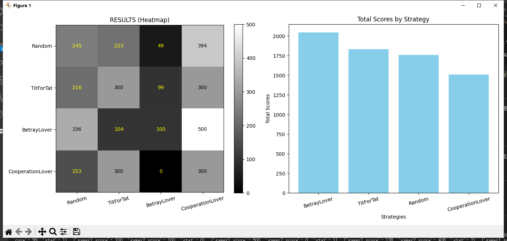

# PrisDilm: 囚徒困境博弈模拟平台

PrisDilm 是一个用于模拟和分析囚徒困境博弈策略的 Python 项目。通过定义不同的博弈者策略，用户可以模拟多轮博弈并可视化结果。

## 功能

- 定义多种博弈策略（如随机策略、以牙还牙策略等）。
- 模拟多轮博弈，计算得分并判断胜负。
- 可视化博弈结果，包括热力图和柱状图。

## 博弈规则

- 博弈者可以选择合作或背叛
- 一方合作，另一方背叛，合作方得分 0, 背叛方得分 5
- 双方合作，双方得分 3
- 双方背叛，双方得分 1
- 得分多者获胜

## 项目结构

```plaintext
prisdilm/
├── api.py               # 定义博弈的核心接口和数据结构
├── game_core.py         # 实现博弈核心逻辑
├── gamers/              # 各种博弈者策略的实现
│   ├── randomer.py      # 随机策略
│   ├── tit_for_tat.py   # 以牙还牙策略
│   ├── examples.py      # 示例策略
│   └── __init__.py      # 导出所有博弈者
└── __init__.py          # 包初始化
main.py                  # 项目入口，运行博弈模拟
```

## 安装

1. 确保已安装 Python 3.11 或更高版本。
2. 克隆项目到本地：
   ```bash
   git clone https://github.com/Xnors/PrisDilm.git
   cd PrisDilm
   ```
3. 安装依赖：
   ```bash
   pip install matplotlib
   ```
   本项目使用 [`uv`](https://docs.astral.sh/uv/) 构建，您还可以运行：
   ```bash
   uv sync
   ```

## 使用方法

运行项目主入口：

```bash
python main.py
```

或

```bash
uv run main.py
```

### 自定义博弈者

> 详见: [开发文档](./docs/DEVDOC.md#5-gamerinterface-博弈者接口-abcabc)

您可以通过继承 `GamerInterface` 类来定义自己的博弈者策略。例如：

```python
from prisdilm.api import GamerInterface, Decision

class MyCustomGamer(GamerInterface):
     def __init__(self, name="MyCustomGamer"):
          super().__init__(name)

     def decide(self, game_states, whoami):
          # 自定义决策逻辑
          return Decision.COOPERATE
```

然后将其添加到 `gamers/__init__.py` 的 `all_gamers` 列表中。

> 注: 请将对您的博弈策略的介绍放到 `docs/GAMERS.md` 中, 以便查阅.

## 可视化结果

运行后，程序会生成热力图和柱状图，展示不同策略之间的博弈结果。

示例:


## 文档

- [开发文档](./docs/DEVDOC.md)

  介绍了项目的接口, 运行方法, 自定义博弈者/贡献博弈策略的方法 等.

- [博弈者文档](./docs/GAMERS.md)

  介绍了已实现的各种博弈者策略

## 贡献

欢迎提交 Issue 或 Pull Request 来改进此项目。

或者添加新的博弈者策略, 与大家分享.

## 许可证

此项目使用 [MIT](./LICENSE) 许可证。
